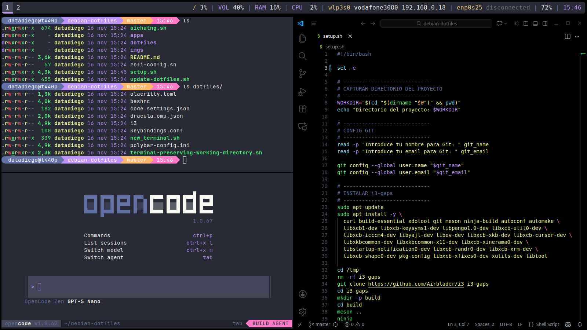

# Script de inicio debian/ubuntu

Este script instala varias herramientas básicas para mejorar la productividad en sistemas debian/ubuntu



## Instalación

Desde una terminal ejecuta:

```bash
git clone https://github.com/datadiego/debian-dotfiles
cd debian-dotfiles
./setup.sh
```

Se te preguntará tu nombre y dirección de correo para configurar git con esos mismos datos, una vez termine, tendrás listo tu entorno, cierra sesión y entra desde *i3*.

## Desktop Enviroment

- **i3**: Gestor de ventanas por teclado.
- **polybar**: Reemplazo de i3bar moderno.
- **rofi**: Reemplazo de dmenu moderno.
- **alacritty**: Terminal personalizable moderna.
- **eza**: Reemplazo de ls.
- **oh-my-posh**: Customizacion de prompt y terminal.

# Keybindings

- **Super + enter**: Nueva terminal
- **Super + d**: Menu de aplicaciones
- **Super + v**: Apilar en modo vertical
- **Super + h**: Apilar en modo horizontal
- **Super + r**: Modo resize
- **Super + b**: Navegador
- **Super + a**: ChatGPT
- **Super + p**: Screenshot

## Herramientas

- git
- gh-cli
- lazygit
- sqlite3
- VSCode
- Chromium
- opencode
- ChatGPT (PWA)
- npm
- nodejs
- micro

## Configuración

Aunque todo viene configurado, puedes añadir tus propias configuraciones a todos los dotfiles incluidos antes o despues de la instalación.

A continuación se referencian los archivos y localizaciones donde puedes editarlos.

### i3

i3 es tu gestor de ventanas, el directorio es `~/.config/i3` y se compone de:

- **config**: configuración principal de i3, aqui puedes editar los aspectos básicos del editor, atajos para controlar las ventanas, terminales y como se comporta.
- **keybindings.conf**: configuración para atajos de teclado extra, como lanzar el navegador, *PWAs* y otras aplicaciones que necesites.
- **terminal-preserving-working-directory.sh**: script para que la terminal se abra en el directorio activo en el que ya estamos situados previamente. Si prefieres que siempre se abra en tu `/home`, simplemente edita tu `config` con cualquiera de las otras opciones que hay comentadas en su sección.

### polybar

Barra de información moderna alternativa a la original de i3, tiene la configuración por defecto, que es bastante completa. Su directorio se encuentra en `~/.config/polybar`.

### alacritty

Alacritty es una terminal alternativa a `gnome-terminal`, nos permite personalización y customización más simple, su directorio está en `~/.config/alacritty`

Dentro solo encontrarás un archivo `alacritty.toml` con la configuración de fuentes necesaria para *oh-my-posh*, y la configuración de paleta de colores.

### oh-my-posh

*Oh my posh* configura la terminal para mostrar un prompt más dinámico que el original, nos permite añadir modulos y configurar su paleta de colores. El directorio es `~/.config/oh-my-posh`, donde se encuentra su archivo único de configuración.

## Crear aplicaciones PWA

En `dotfiles/keybindings.conf` verás un esquema básico de como agregar aplicaciones web progresivas a tu sistema y añadirles un atajo de teclado:

```plaintext
bindsym $mod+a exec --no-startup-id gtk-launch chatgpt
```

Ese atajo ejecuta el archivo `chatgpt.desktop` que tenemos en `~/.local/share/applications/chatgpt.desktop`.

Puedes crear tus propias aplicaciones desde cualquier web en *chromium* desde el menu `opciones > Enviar, guardar y compartir > Instalar`.

Esto creará un archivo `.desktop`, puedes cambiarle el nombre por uno más simple y lanzarlo con la combinacion que quieras editando tu `keybindings.conf` situado en `~/.config/i3/keybindings.conf`